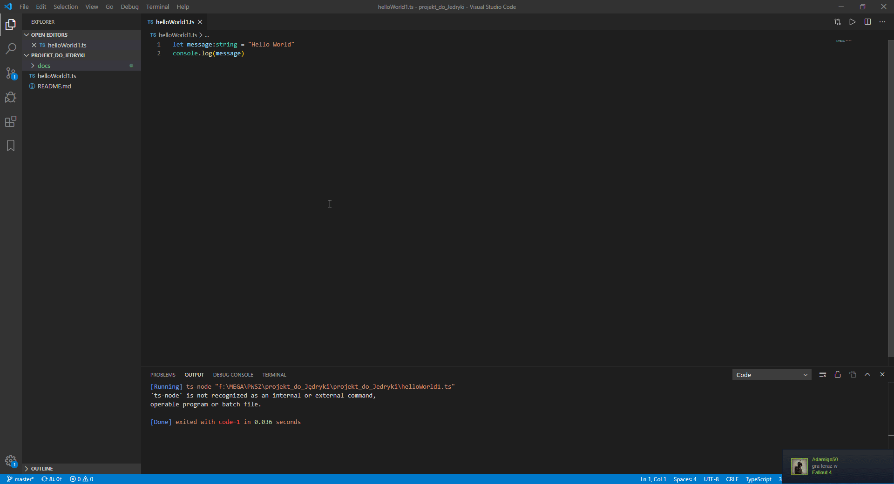

# Projekt do mgr Jedryki (PWA)

## Projekty wzorcowe 
- https://developers.google.com/web/tools/lighthouse/v3/scoring
 - https://dev.opera.com/blog/pwa-taipei/
 - https://medium.com/james-johnson/a-simple-progressive-web-app-tutorial-f9708e5f2605
 - https://medium.com/becode/introduction-to-pwa-set-up-660df31934f2
 * Moje literki PW  

