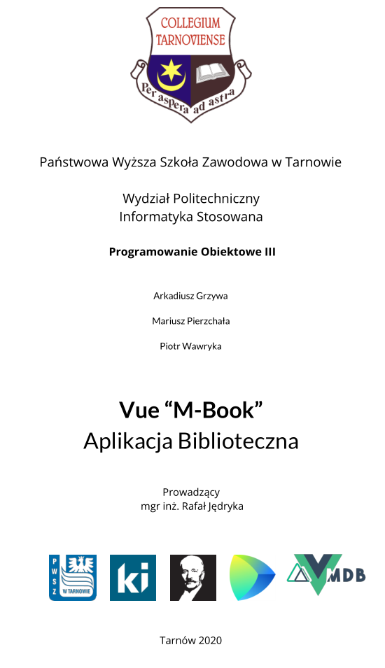
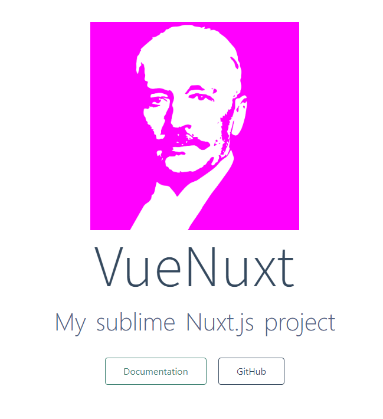
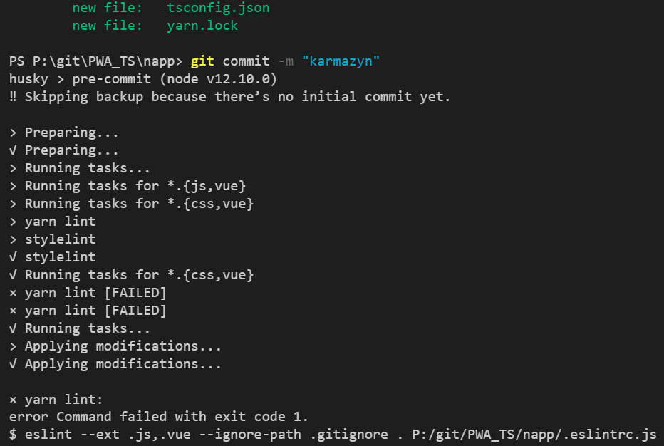

# <a href="https://pwsz.jetbrains.space/p/nos/checklists"></a>[M-Book Project](https://pwsz.jetbrains.space/p/nos/checklists)

[

](https://docs.google.com/document/d/1wINwCWPQtst-vIdEWe1Ug0ty0_JZGyYkeoQt_ZbO-8c/edit?usp=sharing)

### Decyzje

- https://vuetifyjs.com/en/getting-started/pre-made-layouts/ (nav or sied bar)
- https://vue.mdbootstrap.com/#/tables/datatableJSON (reprezentacja wyników tabela lub karty)

https://bootstrap-vue.org/docs/reference/starter-templates (global compotent)

## Istotne katalogi app/:

compotent
page
static

### Koncept

- Baza Tytułów Książek (ok. 10 MB) jest przechowywana lokalnie
- Aplikacja PWA umożliwia w pełni wyszukiwanie książek offline (po pierwszym pobraniu bazy oczywiście) :smirk: :innocent:

### Projekty wzorcowe, pomoce naukowe, przydasie

- Pierwsza iteracja [projektu](https://github.com/informacja/szukaj) [**Katalogu ZST**](https://katalog.zst-tarnow.pl) - strona internetowa (like OPAC)

<<<<<<< HEAD

- [Vue Mastery](https://medium.com/vue-mastery)
- [Nuxt](https://github.com/nuxt/nuxt.js/tree/dev/examples)
- [Passionate People](https://passionatepeople.io/#our-expertise)
- [Nuxt Cheat Sheet](https://github.com/Mario62/PWA_TS/raw/dev/docs/Nuxtjs-Cheat-Sheet.pdf)
- # https://alligator.io/vuejs/ Example interfaces https://alligator.io/vuejs/using-typescript-with-vue/

* [Vue Mastery](https://medium.com/vue-mastery)
* [Nuxt](https://github.com/nuxt/nuxt.js/tree/dev/examples)
* [Passionate People](https://passionatepeople.io/#our-expertise)
* [Nuxt Cheat Sheet](https://github.com/Mario62/PWA_TS/raw/dev/docs/Nuxtjs-Cheat-Sheet.pdf)
* https://alligator.io/vuejs/ Example interfaces https://alligator.io/vuejs/using-typescript-with-vue/

* [Courses eg. static generation](https://vueschool.io/courses/vuex-for-everyone) https://vueschool.io/courses/nuxtjs-fundamentals
* Router https://vueschool.io/lessons/linking-between-pages
* https://vueschool.io/courses/vuejs-components-fundamentals
* https://vueschool.io/courses/vue-router-for-everyone
* [Black Theme Example](https://demos.creative-tim.com/nuxt-black-dashboard-pro/)
* [PWA Nuxt workbook](https://pwa.nuxtjs.org/modules/workbox.html#options)
* https://github.com/nuxt-community/awesome-nux
* [async-data](https://nuxtjs.org/guide/async-data)

> > > > > > > 565dbbac5287441beb445b918493a154efeb4a46

- [Courses eg. static generation](https://vueschool.io/courses/vuex-for-everyone) https://vueschool.io/courses/nuxtjs-fundamentals
- Router https://vueschool.io/lessons/linking-between-pages
- https://vueschool.io/courses/vuejs-components-fundamentals
- https://vueschool.io/courses/vue-router-for-everyone
- [Black Theme Example](https://demos.creative-tim.com/nuxt-black-dashboard-pro/)
- [PWA Nuxt workbook](https://pwa.nuxtjs.org/modules/workbox.html#options)
- https://github.com/nuxt-community/awesome-nux

## GUI

- https://mdbootstrap.com/docs/jquery/forms/search/

## Nowa aplikacja oparta na Nuxt.js eg. [Nuxt-Boilerplate](https://github.com/mdbootstrap/MDB-Vue-Nuxt-Boilerplate)



## W momencie robienia commit-a kod jest sprawdzany :)



## Schemat bazy danych


- https://stackblitz.com
- https://demos.creative-tim.com/vue-paper-dashboard/#/ Vue MD example
- https://www.jetbrains.com/help/idea/markdown.html How to use diagrams
- [Nuxt Cheat Sheet](https://github.com/Mario62/PWA_TS/blob/dev/docs/Nuxtjs-Cheat-Sheet.pdf)

## Schemat bazy danych


#### Uruchamianie aplikacji np. w WebStorm


### Klasy w Vue


## RegExp

> https://pythex.org

```ts
    (3[12][0-9]{3}).+\\x22([A-Za-z]+.[a-zA-Z]+)\\x22
```

> https://regex101.com

[StackOverflow przykład](https://stackoverflow.com/questions/2013124/regex-matching-up-to-the-first-occurrence-of-a-character)

[WYRAŻENIA REGULARNE DLA NIEPROGRAMISTÓW](http://namiekko.pl/2016/12/09/wyrazenia-regularne-dla-nieprogramistow)

[perl komentarze w wyrazeniach regularnych](https://linuxexpert.pl/posts/2694/perl-komentarze-w-wyrazeniach-regularnych)

[Decyzje]

### Decyzje

- https://vuetifyjs.com/en/getting-started/pre-made-layouts/ (nav or sied bar)
- https://vue.mdbootstrap.com/#/tables/datatableJSON (reprezentacja wyników tabela lub karty)

https://bootstrap-vue.org/docs/reference/starter-templates (global compotent)

### TODO

###### FronEnd:

- JEDNA WYSZUKAJKA
- Podpowiedzi z vuex store

* Mutacja
* Zapis do store (przez mutację)

##### Backend

- Store to pamiec nieulotna i init (local storage or server side)
- validacja poprawności zapytań

- Team page
  https://localforage.github.io/localForage/
