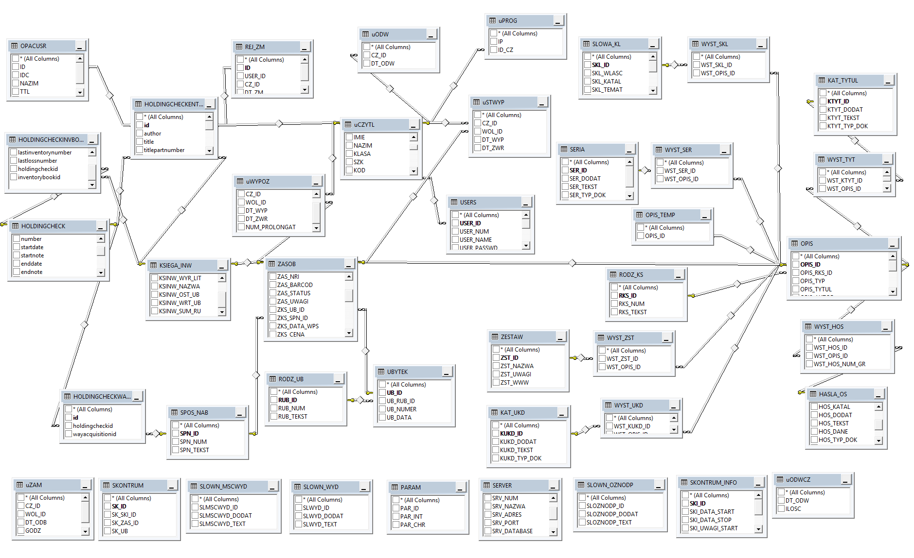
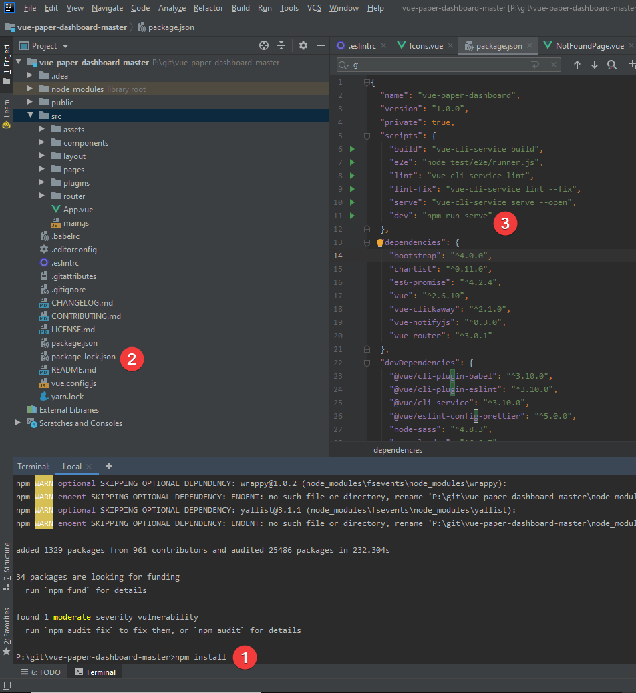
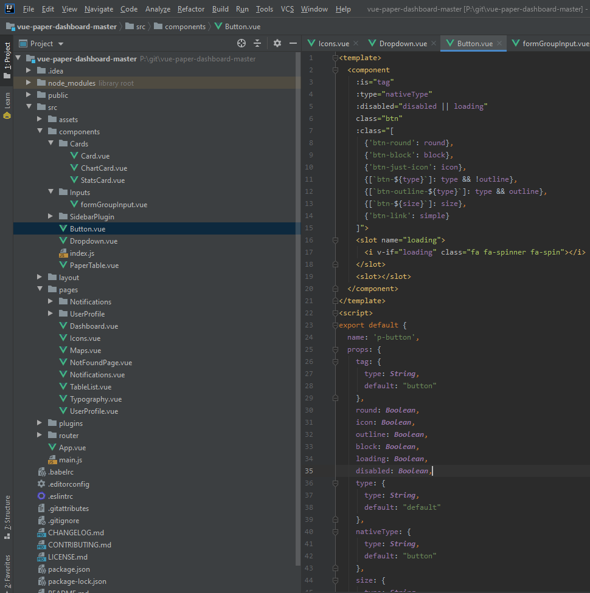

#  <a href="https://pwsz.jetbrains.space/p/nos/review"></a>[M-Book Project](https://github.com/Mario62/RWD_TS/projects/1)

### Koncept
* Baza Tytułów Książek (ok. 10 MB) jest przechowywana lokalnie 
* Aplikacja PWA umożliwia w pełni wyszukiwanie książek offline (po pierwszym pobraniu bazy oczywiście :D)

### Projekty wzorcowe 

* Pierwsza iteracja [projektu](https://github.com/informacja/szukaj) [**Katalogu ZST**](https://katalog.zst-tarnow.pl) - strona internetowa (like OPAC)
* https://demos.creative-tim.com/vue-paper-dashboard/#/ Vue MD example
* https://www.jetbrains.com/help/idea/markdown.html How to use diagrams

## Schemat bazy danych



#### Uruchamianie aplikacji np. w WebStorm


### Klasy w Vue 


## RegExp

> https://pythex.org


```ts
    (3[12][0-9]{3}).+\\x22([A-Za-z]+.[a-zA-Z]+)\\x22
```
> https://regex101.com

> [pwsz.jetbrains.space](https://pwsz.jetbrains.space)
> 
> [Chat](https://pwsz.jetbrains.space/im/group/1Bdbrz1w1iEc)

> [Commits](https://pwsz.jetbrains.space/p/nos/code/vuePWA/commits)

